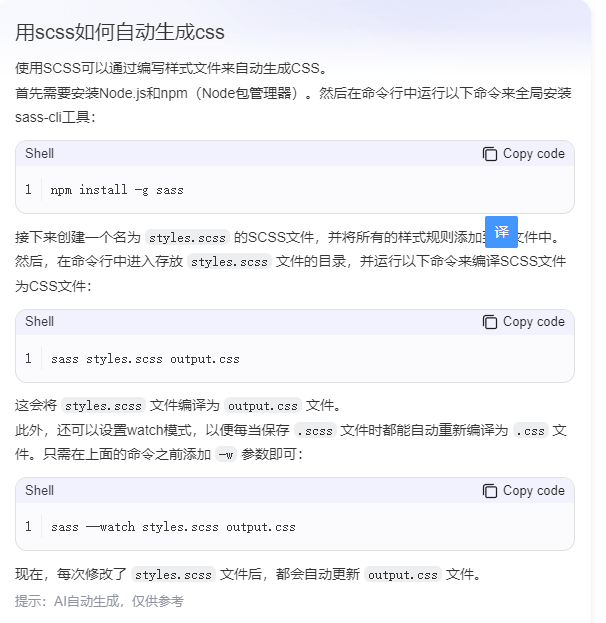

## scss - 增加变量的css形式


### 1.为css增加变量，让其更好的修改重复的属性，更简洁的代码

```
$color:red;

$size:30px;
ul{
  
    font-size: $size;
    color: $color;
  
}

ol{
  font-size: $size;
    color: $color;
}
```

### 2.简化计算权重，精准控制页面上的元素

// 只需要根据结构在scss中写即可，会自动编译成css文件


使用方法注意：


如果想随时更新编译编译：使用参数--w
```
sass --watch variables.scss variables.css
```
2.引用时，需要使用编译后形成的文件css文件，而不是scss，因为浏览器无法识别scss。

```
  <link rel="stylesheet" href="nesting.css">
```


### 3.封装继承，将相同的属性封装，使用时继承

```
%message{
  font-family: sans-serif;
  font-size: 18px;
  font-weight: bold;
  border: 1px solid black;
  padding: 20px;
  margin: 20px;
}

.success{
  @extend %message;
  background-color: green;
}

.error{
  @extend %message;
  background-color: red;
}

.good{
  @extend %message;
  background-color: cadetblue;
  font-size: 30px;
}
```