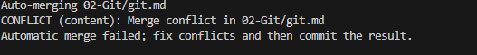

# Git 的简单用法

### keep track of changes to code

* Synchronizes code between diffenent people
* Test changes to code without losing the original


## github and git

github  is a website that stores git respositories.


## git clone

从远程仓库下载到自己本地电脑


## git add /git commit

git add 是将变化添加到保存区

git commit 是提交

##  git commit -am "message"   =>两个命令结合

前提是不涉及**新的文件**
注意：

>git commit -am "message" 命令可以在以下情况下使用：

>已跟踪的文件的修改：当您想要提交的更改只涉及到已经被 Git 跟踪的文件的修改时（即这些文件已经在之前的提交中被添加到了 Git 仓库中），您可以使用这个命令。-am 选项会自动把所有已跟踪文件的修改添加到暂存区（staging area），并创建一个新的提交。这意味着您不需要单独执行 git add 命令来暂存这些修改。

>没有新文件或删除文件：如果您没有添加新的文件到仓库，也没有从仓库中删除文件，那么可以使用这个命令。git commit -am 不会将新文件（未跟踪文件）添加到提交中，也不会处理已删除的文件。

请注意：

>如果您的更改包括新增文件（之前未被 Git 跟踪的文件）或删除文件，那么您需要先使用 git add <file>（对于新文件）或 git rm <file>（对于删除的文件）来更新暂存区，然后再使用 git commit -m "message" 来提交。
对于新文件，git add <file> 或 git add .（添加当前目录下的所有更改）需要在 git commit 之前执行。
git commit -am 不会包括子模块的更改，如果您在使用子模块，需要单独处理子模块的更改。
总结来说，git commit -am "message" 是一个快捷方式，适用于简单的工作流程，其中只涉及到已跟踪文件的修改，而不涉及新增或删除文件的情况。  


## git push
将本地仓库及变化推到远程（github）的仓库中


## git pull

与git push操作相反，将远程仓库最新的代码，从github上pull下来，同步到本地成最新的;

当远程的代码与本地代码有冲突时，直接将本地代码是无法push到远程的，需要先pull下来，同步，然后再push上去。


## Merge Conflicts


```



当遇到冲突时，编译器会显示冲突的地方：
```
<<<<<< HEAD 

 在此之间是你的版本

=========

在这里是别人的版本
```
 >>>>> d4e3a8002bfc905

** 你需要做的是判断好要哪一个版本？ 单纯要你的，还是别人的，还是两者的结合？ **
然后把出现的提示部分删掉，重新add commit，再push上去。
```
## git log  
查看历史提交记录

## git reset
```
- git reset --hard <commit>
- git reset --hard origin/master

回退到某一次提交的状态

```


## Branching

我们开发的时候有时候不是线性进行的，同时处理多个新功能时，我们开启新的分支。


```
git branch

git checkout -b feature  //创建新的分支并跳转过去

git checkout main  //切换分支


git merge feature   // 将feature分支上的内容 merge到当前分支

当对同一行代码修改后，会产生merge **conflicts*


解决冲突的方式同上述所示的pull时发生冲突，修改之后，重新提交。

```


## fork 

将开源代码建立分支到自己github，然后当自己的贡献达到一定时，可以请求poll request到原来的仓库主分支中。
（理解成更大的协作）

## Github pages

生成一个网址，可以部署自己的静态页面