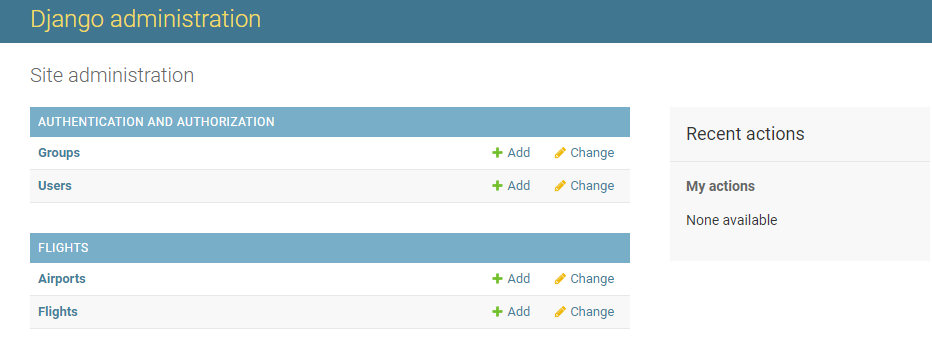

# Django

### 一、创建项目的流程

1.创建整体项目-项目名称

```
django-admin startproject airline
```

2.进入项目文件夹，创建相应的应用

```
cd airline

python manage.py startapp flights

```

3.创建完成后，在项目文件夹的setting中增加新建好的应用

```
--airline
 --settings.py

# Application definition

INSTALLED_APPS = [
    "flights",
    "django.contrib.admin",
    "django.contrib.auth",
    "django.contrib.contenttypes",
    "django.contrib.sessions",
    "django.contrib.messages",
    "django.contrib.staticfiles",
]

```

4.在项目文件夹的urls.py中设置页面的跳转逻辑

```
--airline
 --urls.py

from django.contrib import admin
from django.urls import include,path

urlpatterns = [
    path("admin/", admin.site.urls),
    path("flights/",include("flights.urls"))
]


```

5.在创建的应用文件夹（flights）中，创建urls.py

```
from django.urls import path

from . import views

urlpatterns = []

```

6. models.py 

用来控制SQL，在django中

```
# Create your models here.

class Flight(models.Model):
  origin = models.CharField(max_length=64)
  destination = models.CharField(max_length=64)
  duration = models.IntegerField()

```

在命令行中：

```
python manage.py makemigrations


显示：
Migrations for 'flights':
  flights\migrations\0001_initial.py
    - Create model Flight

  其中生成的文件中0001——initial.py描述的就是Django如何操控数据库的

   operations = [
        migrations.CreateModel(
            name="Flight",
            fields=[
                (
                    "id",
                    models.BigAutoField(
                        auto_created=True,
                        primary_key=True,
                        serialize=False,
                        verbose_name="ID",
                    ),
                ),
                ("origin", models.CharField(max_length=64)),
                ("destination", models.CharField(max_length=64)),
                ("duration", models.IntegerField()),
            ],
        ),
    ]


```

继续敲命令

```
python manage.py migrate
当查看文件夹时，db.sqlite3创建成功
```

继续输命令：

```
python manage.py shell

可以用python的语法直接操控数据库

from flights.models import Flight
f = Flight(origin = "New York",destination="London",duration=415)
f.save()

上述命令相当于插入

Flight.objects.all()
<QuerySet [<Flight: Flight object (1)>]>

// 查询命令


```


7.当创建好项目想要启动运行时，在命令行

```
python  manage.py runserver
```


8.superuser  django设置的admin用户，可以直接通过这部分网页操控数据库和model层

```
python manage.py createsuperuser

```





