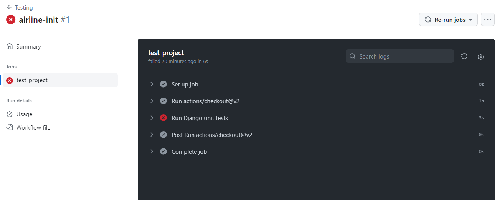
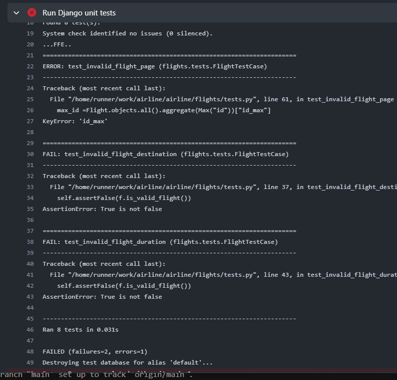
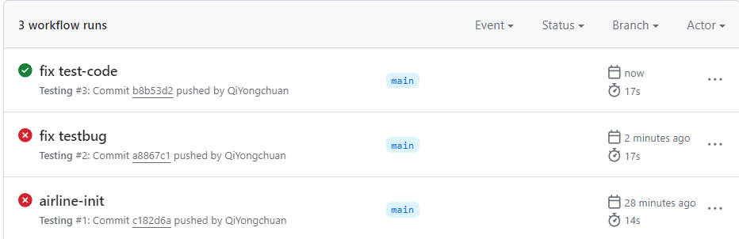

# CI/CD

* CI(continuous integration ) 持续集成
* CD(continuous delivery) 持续交付

指软件开发领域的最佳实践，这与代码的编写方式有关，尤其是一群人如何协作，记忆代码最终是如何交付和部署的，给正在使用这些应用程序的用户。

* Continuous Integration
   * Frequent merges to main branch
   * Automated unit testing

* Continuous Delivery
  * Short release schedules

持续集成：频繁且渐进地更新到主分支，并确保测试通过；
持续交付：对于应用程序不断地变化，持续交付，是指更短的时间内进行交付，而不是在某个长周期结束时，才集中发布某一版本更新，可以在更短的周期内每天都发布。在开发中任何刚好更新到主分支的变化，都将立即更新。
好处是可以进行逐步的改变，如果哪里出现了问题，可以立即确定好问题出现在了哪里；同时允许新功能开发出来后立即更新上市


# 哪些工具可以实现持续交付和持续部署呢？

其中之一：GitHub Actions

Github Actions 可以做什么？
1.创做一个工作流，任何时候有人推送到git存储库，采取某些步骤：
* 自动检查代码风格，保持代码风格一致（比如良好的注释...）
* 来测试代码

## 语法：YAML

```
key1:value1
key2:value2
key3:
    -item1
    -item2
    -item3

language = YAML
```


```
name: Testing
on: push

jobs:
  test_project:
    runs-on: ubuntu-latest
    steps:
    - uses: actions/checkout@v2
    - name: Run Django unit tests
      run: |
       pip3 install --user django
       python manage.py test


```

运行结果：
即将本地写的test 测试代码，在工作流中运行了




每一次提交（push），都会触发一次



## Docker

理解成容器，主要是解决不同环境下配置的问题，软件版本问题等，可以类比虚拟机的概念。但Docker更轻量级，且没有操作系统。

确保能够让一个程序在所处的环境中运行，确保安装了所有正确的库，与软件的版本，确保开发环境与服务器的环境一致。


